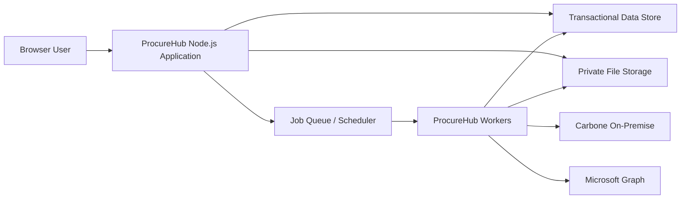
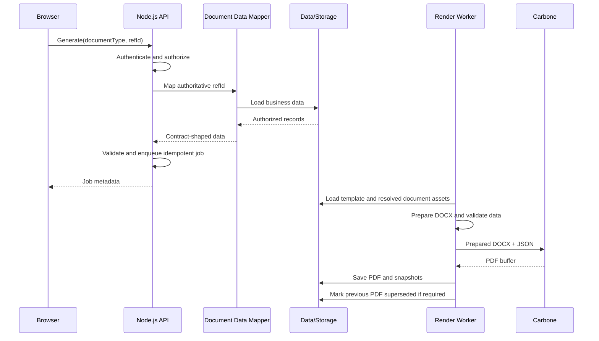

# ProcureHub System Architecture

**Status:** Approved<br>
**Date:** 2026-07-15<br>
**Approved date:** 2026-07-15<br>
**Approved by:** Product Owner<br>
Scope: Logical architecture and module boundaries; physical deployment and undecided framework choices are excluded

## 1. Architecture Goals

- Preserve strict multi-company authorization and auditability.
- Keep document and workflow engines generic.
- Isolate external services behind replaceable adapters.
- Support reliable background rendering and notification work.
- Make business modules independently testable.
- Begin with the smallest operable deployment without preventing later extraction.

## 2. Confirmed Technology Boundaries

Approved:

- Node.js application runtime
- Carbone On-Premise for prepared DOCX rendering and PDF conversion
- React Email for code-owned transactional email presentation
- Microsoft Graph app-only delivery from one central Microsoft 365 mailbox

Not selected by this document:

- Frontend framework
- Backend HTTP framework
- Database and ORM
- Queue technology
- Local versus S3-compatible production storage
- Authentication provider
- Container/orchestration platform
- Test framework

Those choices require the implementation plan or a focused ADR.

## 3. Logical Context



This is a logical diagram. The API and workers may initially run in one deployable Node.js application while retaining separate module and adapter boundaries.

## 4. Application Layers

```text
Delivery
  HTTP routes, request parsing, authentication context, response mapping

Application
  Use cases, authorization orchestration, transactions, idempotency

Domain
  Contracts, lifecycle rules, workflow rules, numbering, invariants

Ports
  Repository, storage, queue, mail, renderer, clock, identity interfaces

Adapters
  Database, local/S3 storage, Carbone, Microsoft Graph, queue implementation
```

Domain and application code do not import HTTP, database, Carbone, Graph, or storage implementation details.

## 5. Bounded Modules

### Identity and Access

Authentication identity, roles, permissions, company/branch scope, and authorization policies.

### Organization

Company, branch, division, department, memberships, positions, effective assignments, and assignment-change events.

### Vendor and Procurement Master Data

Vendors, categories, units, tax configuration, cost centers, projects, and later procurement configuration.

### Document Contract and Template

Contract registry, Tag Sheet, template scanning, validation, preview, activation, and versions.

### File and Attachment

Private storage, upload validation, malware scan hook, metadata, authorization, and downloads.

### Document Rendering

DOCX preparation, versioned company/branch document assets, Carbone client, render jobs, generated PDFs, and snapshots.

### Document Numbering

Versioned patterns, effective-dated rule selection, transactional sequence allocation, reset periods, issuance idempotency, uniqueness, and no-reuse rules.

### Document Lifecycle

High-level document state, edit locking, revisions, approval rounds, cancellation, closure, and status history.

### Workflow Definition

Versioned definitions, scopes, constrained visual layout, validation, simulation, activation, and rollback.

### Workflow Runtime

Workflow resolution, instances, step/task activation, approver resolution, actions, return/revision, delegation, and reconciliation.

### SLA and Calendar

Business calendars, due-date snapshots, reminders, and overdue derivation.

### Notification

In-app notifications, React Email rendering, Graph jobs, preferences allowed by policy, and attempt history.

### Timeline and Audit

Unified read model over immutable domain events and audit history.

### Business Modules

PR, PO, and later RFQ/receiving/invoice modules own business fields and calculations, then call generic services through explicit interfaces.

## 6. Dependency Direction

- Business modules may depend on generic platform ports.
- Generic platform modules do not depend on PR or PO implementations.
- Workflow runtime receives document context through an adapter; it does not query PR/PO tables directly.
- Document rendering receives data through a registered mapper; it does not accept browser payloads as truth.
- Timeline reads events from modules but does not own their state transitions.
- External adapters implement ports defined by application/domain modules.

Circular module dependencies are not allowed.

## 7. Transaction Boundaries

Operations requiring one atomic transaction include:

- Template activation and archival of previous active version
- Workflow preflight success followed by instance/round/step creation
- Approval action, task transition, next-step activation, lifecycle update, and outbox event
- Document number allocation and document submission
- Generated-document success and superseding the prior current PDF

External network calls do not occur inside long database transactions. Use an outbox/job record committed with domain state, then perform Carbone or Graph work asynchronously.

## 8. Event and Job Reliability

Recommended logical pattern:

```text
Domain transaction
  -> state changes + outbox/job record commit
  -> worker leases job
  -> external action
  -> attempt record
  -> success/failure transition
```

Requirements:

- Idempotency keys for client-triggered mutations and generation requests
- Worker lease or optimistic version
- Bounded retries with jitter for retryable failures
- Dead-letter or terminal failure state
- Correlation ID propagated through API, job, external adapter, timeline, and logs
- Notification failure never rolls back an approval already committed

## 9. Multi-Company Data Isolation

- Every company-owned aggregate includes `companyId`.
- Authorization scope is applied in application services and repository queries.
- Branch and department identifiers are validated against company ownership.
- The frontend selector does not grant access.
- Cross-company administration is an explicit permission and audit category.
- Cache keys, object paths, idempotency keys, and uniqueness constraints include tenant scope when relevant.

## 10. Document Generation Data Flow



## 11. Workflow Runtime Data Flow

- Submission performs authorization, requirement validation, workflow resolution, condition evaluation, approver preflight, and self-approval checks.
- A successful transaction creates all applicable/skipped step instances.
- First applicable task is `pending`; future applicable tasks are `waiting`; non-applicable tasks are `skipped`.
- A waiting step resolves the actual approver when activated.
- An effective Organization Assignment or Delegation change reconciles pending tasks and may reassign them with full audit.
- Completed task history is immutable.

## 12. API Conventions

- Version APIs through an explicit compatibility policy before public integration.
- Validate request shape and canonical codes at the boundary.
- Return stable machine error code, localized/readable message, field details when safe, and correlation ID.
- Use cursor or stable pagination for large operational lists when selected stack supports it.
- Reflect list filter/sort state in query parameters.
- Require idempotency keys for high-risk repeatable mutations.
- Never return internal paths, secrets, raw provider errors, or full audit payloads without permission.

## 13. Observability

Minimum signals:

- Structured logs with correlation, actor, company, module, operation, and safe outcome
- Metrics for request latency/error, approval age, resolution errors, render duration/failure, queue depth, Graph failure/throttling, and storage errors
- Traces across API, job, Carbone, Graph, and storage adapters where supported
- Health checks separated into liveness and readiness
- Audit records separated from operational logs

Do not log document payloads, email bodies, access tokens, template buffers, or PDF content.

## 14. Failure Behavior

- Database transaction failure leaves no partial workflow or number allocation.
- Missing approver blocks submission or pauses activation as specified; it never skips approval.
- Carbone failure leaves a retryable/failed job and no successful GeneratedDocument.
- Storage failure prevents successful render completion.
- Graph failure records an attempt and retries without undoing the business action.
- Organization reconciliation and approval action use concurrency protection so only one valid transition wins.

## 15. Deployment Direction

Version 1 may be deployed as a modular Node.js application plus background workers, transactional database, private file storage, Carbone, and Microsoft Graph connectivity.

Physical separation is driven by scaling, security, or operational evidence. Module boundaries must exist before any service extraction. A microservice split is not a version 1 goal.

## 16. Architecture Verification

- Module dependency tests prevent generic core from importing business modules.
- Authorization integration tests cover cross-company access.
- Transaction tests cover workflow start, approval, numbering, activation, and supersede races.
- Contract tests cover storage, queue, Carbone, and Graph adapters.
- Failure injection verifies external errors do not corrupt domain state.
- Load tests focus on operational lists, concurrent submissions, rendering, and reminder jobs.

## 17. Related Documents

- [Developer Handoff](../../DEVELOPER_HANDOFF.md)
- [Organization Model](../product/ORGANIZATION_MODEL.md)
- [Document Engine Design](../superpowers/specs/2026-07-15-procurehub-document-engine-design.md)
- [Document Numbering Design](../superpowers/specs/2026-07-15-procurehub-document-numbering-design.md)
- [Workflow Design](../superpowers/specs/2026-07-13-procurehub-workflow-design.md)
- [Core Data Model](../data/CORE_DATA_MODEL.md)
- [File and Document Security](../security/FILE_AND_DOCUMENT_SECURITY.md)
