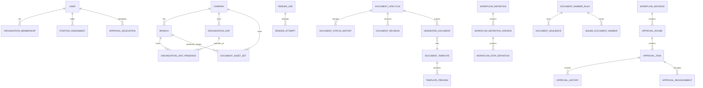

# ProcureHub Core Data Model

**Status:** Approved<br>
**Date:** 2026-07-15<br>
**Approved date:** 2026-07-15<br>
**Approved by:** Product Owner<br>
Scope: Logical platform data model before database and ORM selection

## 1. Purpose

This document defines entity ownership, relationships, invariants, snapshots, and concurrency requirements. It intentionally avoids database-specific column types and migration syntax.

PR and PO business fields are outside this core model and will be defined in their own specifications.

## 2. Shared Conventions

Most mutable records include:

```text
id
createdAt
createdBy
updatedAt
updatedBy
concurrencyVersion
```

Rules:

- `companyId` is required on every company-owned aggregate.
- Time is stored as UTC; effective dates include an explicit timezone/calendar interpretation where required.
- Canonical status/action codes follow `docs/product/TERMINOLOGY.md`.
- Money is stored as amount plus ISO currency code; floating-point storage is not allowed.
- Historical/audit records are append-only.
- JSON snapshots are schema-versioned and immutable.
- Soft deactivation and archive are preferred to deletion for referenced master/configuration data.

## 3. Organization and Identity

### Company

Top-level data and authorization boundary.

Unique: `code`, legal tax identity according to business rules.

### Branch

Belongs to Company. Unique `(companyId, code)`. Head Office is explicit.

### OrganizationUnit

Represents `division` or `department`.

```text
companyId
parentUnitId nullable
unitType
code
nameTh/nameEn
active
```

Unique `(companyId, unitType, code)`.

### OrganizationUnitPresence

Effective association between a branch and organization unit.

### User

Global login identity metadata. Company access is not stored as a single user field.

### OrganizationMembership

Effective-dated user membership in company, branch, division, and department context.

### Role / Permission / RoleAssignment

Role grants permissions; assignment scopes them to authorized organization context.

### PositionAssignment

Effective-dated position holder used by approver resolution. Overlapping primary assignment for an exact scope is prohibited.

### ApprovalDelegation

Effective-dated approval-only delegation. It retains original and acting user identities.

## 4. File and Attachment

### StoredFile

```text
companyId nullable for global system files
purpose
storagePath
originalFileName
mediaType
size
sha256
securityStatus
createdBy/createdAt
```

No client-provided storage path is persisted.

### DocumentAttachment

Links StoredFile to `(documentType, refId)` and records attachment type, uploader, and business visibility.

### FileSecurityEvent

Append-only upload, validation, malware scan, quarantine, and rejection events.

## 5. Document Contract and Template

Contracts are code-owned and registered at runtime. Template records persist their contract version.

### DocumentTemplate

```text
documentType
name
templateVersion
lifecycleStatus: draft | active | archived
validationStatus: pending | valid | invalid
previewStatus: not_generated | generating | succeeded | failed
sourceFileId
fileHash
detectedTagsJson
unknownTagsJson
missingRequiredTagsJson
contractVersion
validationErrorsJson
lastPreviewedAt nullable
activatedAt/activatedBy nullable
concurrencyVersion
```

Unique `(documentType, templateVersion)`. Exactly one active template version per document type in version 1.

### TemplatePreview

Immutable preview attempt with sample case, organization context, prepared asset version, output file, status, duration, and safe error.

### DocumentAssetSet

Versioned header/footer asset set for `(companyId, branchId nullable)`. A null branch is the Company Default asset scope; no Global Default is allowed for final branded documents. Old versions are retained.

### PreparedTemplateCache

Optional derived cache keyed by template hash, asset version, preparer version, and compatibility version. It is rebuildable and not the audit source of truth.

## 6. Generated Documents and Rendering

### RenderJob

```text
companyId
documentType
refId
templateId
idempotencyKey
status: queued | rendering | retrying | succeeded | failed | cancelled
attemptCount/maxAttempts
lastErrorCode/safeLastError
requestedBy
leaseOwner/leaseUntil or version
createdAt/startedAt/finishedAt
```

The selected queue adapter determines lease implementation, but one job can have only one successful completion.

### RenderAttempt

Append-only attempt number, start/end, adapter result, duration, retry classification, and correlation ID.

### GeneratedDocument

```text
companyId
documentType
refId
documentNumber nullable
templateId/templateVersion
contractVersion
documentAssetSetId/assetVersion nullable
preparerVersion
dataSnapshotJson
approvalSnapshotJson nullable
pdfFileId/fileHash nullable until successful generation
status: generating | generated | failed | superseded | voided
supersededById nullable
generatedBy/requestedAt/generatedAt nullable
```

At most one current usable `generated` GeneratedDocument exists per document according to document policy. A terminal render failure retains a `failed` intent without PDF metadata. Historical records remain immutable.

## 7. Document Lifecycle

### DocumentLifecycle

```text
companyId
documentType
refId
currentStatus
revisionNo
approvalRound
editLocked
latestGeneratedDocumentId nullable
returnedBy/returnedAt/returnedReason nullable
concurrencyVersion
```

Unique `(documentType, refId)` within the relevant company boundary.

### DocumentStatusHistory

Append-only transition with from/to status, action, actor, reason, comment, metadata, and timestamp.

### DocumentRevision

Immutable revision number, schema version, data snapshot, change summary, changed fields, actor, and timestamp.

## 8. Workflow Definition

### WorkflowDefinition

Logical identity of a workflow family and scope.

```text
documentType
name
companyId nullable
branchId nullable
departmentId nullable
```

### WorkflowDefinitionVersion

```text
workflowDefinitionId
workflowVersion
lifecycleStatus: draft | active | archived
visualLayoutJson
createdBy/createdAt
activatedBy/activatedAt nullable
```

An active version is immutable. One active version exists per exact workflow scope.

### WorkflowStepDefinition

```text
workflowDefinitionVersionId
stepOrder
stepCode
stepName
actionType
approverResolverCode/config
resolverScopePolicy
conditionDefinition nullable
required
allowReject/allowReturn
requiresComment
distinctApproverGroup nullable
returnStrategy
slaMode/slaValue/reminderPolicy
active
```

## 9. Workflow Runtime

### WorkflowInstance

```text
companyId
documentType
refId
workflowDefinitionVersionId
workflowSnapshotJson
contextSnapshotJson
status
currentRoundNo
startedBy/startedAt
completedAt nullable
concurrencyVersion
```

### ApprovalRound

Groups one submit/resubmit attempt and records revision number, strategy, and start/end timestamps.

### ApprovalTask

```text
workflowInstanceId
approvalRoundId
stepDefinitionSnapshotJson
stepOrder/stepCode/stepName/actionType
resolverCode/resolverContextJson
assignedToUserId nullable
originalApproverUserId nullable
actingDelegateUserId nullable
assignmentSnapshotJson nullable
status: waiting | pending | approved | acknowledged | returned | rejected | skipped | cancelled | resolution_error
dueAt/calendarVersion nullable
actedBy/actedAt/comment nullable
concurrencyVersion
```

Runtime invariants:

- First applicable task is pending; later applicable tasks are waiting.
- Waiting tasks do not have a final assignee snapshot.
- Pending tasks may be automatically reassigned after an effective Organization Assignment or Delegation change.
- Reassignment is audited and concurrency-protected.
- Completed task assignment, actor, result, and comment are immutable.
- Only the valid pending assignee/delegate can act.

### ApprovalHistory

Append-only action and transition history.

### ApprovalReassignment

Append-only old/new assignee, resolver, effective source, reason, actor/source, and timestamp.

### ApprovalTaskSlaEvent

Reminder and overdue events. Version 1 does not automatically escalate or reassign from SLA.

## 10. Numbering

### DocumentNumberRule

```text
documentType
companyId
branchId nullable
departmentId nullable
name
pattern
resetPeriod
issueTriggerAction
timezone
effectiveFrom/effectiveTo
lifecycleStatus
ruleVersion
concurrencyVersion
```

### DocumentSequence

```text
ruleId
scopeKey
periodKey
currentValue
concurrencyVersion
updatedAt
```

Allocation is transactional and unique. Issued numbers are never reused, including cancelled documents.

### IssuedDocumentNumber

Immutable record containing company, document type/refId, formatted document number, rule ID/rule version, scope key, period key, sequence value, issue-trigger action, actor, and issued timestamp.

### NumberAllocationAudit

Append-only record of allocation, activation, archive, reconciliation, validation failure, and privileged correction events. Allocation and the business lifecycle transition that makes a number official are atomic where the selected persistence adapter supports a shared transaction. A committed issued number is never reused.

## 11. Notification

### InAppNotification

Recipient, type, title/body translation data, related document/task, read state, and timestamps.

### NotificationJob

Channel, template code/version, recipient resolution snapshot, payload snapshot, status, retry policy, and correlation ID.

### NotificationAttempt

Append-only provider result, attempt count, provider request ID, duration, safe error, and timestamp.

Notification failure does not roll back workflow or lifecycle state.

## 12. Audit and Timeline

### AuditEvent

Security and administrative changes with actor, organization context, entity type/id, action, before/after summary or hash, source, IP/device metadata when policy permits, and timestamp.

### TimelineItem

Prefer a read model projected from lifecycle, workflow, revision, file, render, SLA, and notification events rather than a second mutable source of truth.

Timeline ordering uses event timestamp plus a stable sequence for equal timestamps.

## 13. Logical Relationships



## 14. Concurrency and Uniqueness

Require database-supported enforcement for:

- One active template per document type
- One active workflow version per exact scope
- One lifecycle record per document type/refId
- One successful current PDF according to policy
- Unique official document number within a company
- Non-overlapping primary position assignment per exact scope
- One valid completion per approval task
- Idempotency key uniqueness within actor/company/operation scope

Optimistic version checks are required on template activation, lifecycle mutation, workflow/task action, assignment reconciliation, render job lease, and sequence allocation when not protected by stronger transactional locking.

## 15. Snapshot Policy

Snapshot JSON includes:

- `schemaVersion`
- canonical codes and stable IDs
- display values required for historical readability
- hash when integrity comparison is needed

Snapshots exclude secrets, access tokens, raw files, and unnecessary personal data.

## 16. Retention

- Issued numbers, completed approvals, revisions, final PDFs, template versions used by documents, and audit events are retained according to future legal retention policy.
- Normal cancellation or archive does not physically delete these records.
- Temporary render/cache data follows operational retention and is rebuildable.

## 17. Related Documents

- [Organization Model](../product/ORGANIZATION_MODEL.md)
- [Product Terminology](../product/TERMINOLOGY.md)
- [System Architecture](../architecture/SYSTEM_ARCHITECTURE.md)
- [Document Engine Design](../superpowers/specs/2026-07-15-procurehub-document-engine-design.md)
- [Document Numbering Design](../superpowers/specs/2026-07-15-procurehub-document-numbering-design.md)
- [Workflow Design](../superpowers/specs/2026-07-13-procurehub-workflow-design.md)
